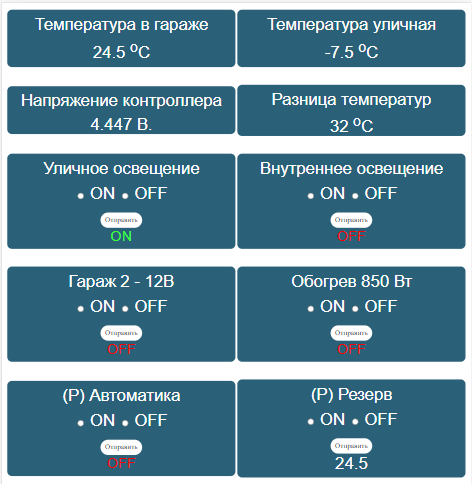

# iot-garage - управление гаражом через интернет
 
Использует в качестве контроллера Arduino (Atmega328) с Ethernet Shild'ом, 
реллейного модуля на 4 канала и датчиков температуры DS18B20. 
Отсылает GET запросы на сервер с показаниями датчиков и в ответ получает команды управления. 
Серверная часть выполнена на PHP. Интерфейс динамический, данные подгружаются Ajax'ом. 
